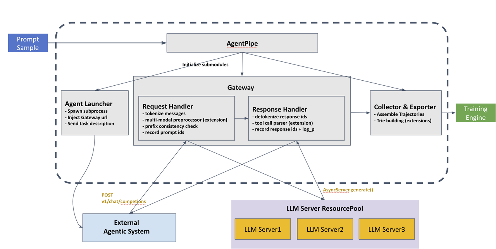

# [RFC] Standardized Agent Trajectory Gateway

## Summary

This RFC proposes a standardized **Trajectory Gateway** for VERL that enables non-invasive trajectory collection from external agent systems. The Gateway implements the OpenAI Chat Completions API as an HTTP proxy, transparently intercepting all LLM calls from any agent framework without requiring modifications to agent code. Collected trajectories are exported as `DataProto` for direct training consumption.

## Motivation

VERL's current agent integration (`agent_loop`) is tightly coupled to specific agent implementations (e.g., SWE-Agent). Each new agent framework requires dedicated adapter code, and trajectory collection logic is embedded within the agent loop itself. As the community adopts increasingly diverse agent frameworks, a standardized interface is needed to:
 
1. **Support arbitrary agent systems** — any framework using the OpenAI Chat Completions API can be integrated without code changes.
2. **Preserve agent-framework independence** — the agent system runs as a black-box subprocess; VERL does not need to understand or embed agent-specific logic.
3. **Collect training-ready trajectories** — including `token_ids`, `logprobs`, and canonical `prompt_ids`, with runtime token-truth guarantees.

## Design Overview

### Architecture



### Core Components

**Agent Pipe**

One Agent Pipe is instantiated per prompt sample and manages the full lifecycle of a single episode — from launching the agent subprocess to collecting and exporting the final trajectory.

**Launcher**

The Launcher takes an agent program (a Python script or an SDK entry point) along with its configuration, and constructs the command to start an agent interaction instance. It injects the Gateway's HTTP address as the agent's LLM endpoint, requiring zero changes to the agent code.

**Gateway (HTTP Proxy)**

An HTTP server exposing `/v1/chat/completions`. The Gateway is the core interception layer that maintains **canonical token truth**:

- **Request handling**: Receives messages from the agent, tokenizes them using the inference backend's tokenizer and chat template. Records the canonical `prompt_ids` and a `render_fingerprint` (tokenizer ID, template hash) for auditability. When multimodal inputs are present, the Gateway will also process them by applying the specified preprocessor.

- **Boundary detection**: On each turn, check the consistency between the prefix of the current prompt_ids and historical prompt_ids:
  - If prefix-preserving → continue current trajectory
  - If prefix mismatch → finalize current trajectory and start new (default), or discard trajectory (strict mode)

The Gateway does not need to understand *why* context changes (compression, agent skill, truncation，or even tokenization-drifting in non-strict mode) — it only observes token-level truth and enforces consistency within each trajectory segment.

See the Token Drift Prevention section for details.

- **Inference routing**: Routes the request to VERL's inference backend. The Gateway supports pluggable backends via a simple adapter interface:
  - **Direct VERL integration (recommended)** (e.g., AsyncLLMServerManager): Gateway calls the backend's generate API with token-level input/output
  - **HTTP-based backends** (e.g., vLLM OpenAI-compatible server): Gateway forwards the request as-is and parses the response to extract token_ids and logprobs

  The choice of backend is deployment-specific. The Gateway abstracts this via a Backend interface that guarantees token_ids and logprobs are returned for every generation.

- **Response handling**: Records the `response_ids` and `logprobs` from the inference backend as-is. Returns a standard OpenAI response to the agent. When tool calling is enabled, using the specified tool parser to extract function call fields of the message.

- **Interaction buffering**: Appends each interaction record to the per-episode buffer.

**Trajectory Collector & Exporter**

After an episode completes, the Collector assembles the interaction buffer into full-sequence trajectories. Each trajectory segment is a continuous token sequence with strict prefix consistency. The Exporter converts trajectories to `DataProto`:

```python
# Per-episode DataProto fields (continuous trajectory format)
{
    "prompt_ids": [...],        # full-sequence canonical prompt tokens
    "response_ids": [...],      # full-sequence response tokens
    "response_logprobs": [...], # per-token log probabilities
    "response_mask": [...],     # 1 for response tokens, 0 for prompt (loss mask)
    "turn_metadata": [          # turn boundaries (for optional downstream processing)
        {"turn": 0, "prompt_end": 128, "response_end": 156},
        {"turn": 1, "prompt_end": 284, "response_end": 312}
    ],
    "reward": 0.5,
}
```

This format is directly compatible with VERL's standard DataProto. The continuous token sequence minimizes training-side preprocessing. Turn boundaries are preserved via metadata, enabling turn-wise views to be derived if needed, without fragmenting the canonical storage format.

For multi-agent systems, trajectories are grouped by agent role.

## Token Drift Prevention

A key challenge in agent RL is ensuring that the token sequences consumed by training exactly match the tokens used during rollout. The Gateway addresses this through a **token truth contract**:

### Contract Components

1. **Single canonical renderer**: Gateway's `ChatRenderer` uses the inference backend's tokenizer and chat template. All `messages → prompt_ids` conversions happen here, ensuring consistency with the model's actual input processing.

2. **Runtime token truth**: Response `token_ids` and `logprobs` are recorded as-is from the inference backend. No re-tokenization on the training side.

3. **Render fingerprint**: Each turn records a `render_fingerprint` (tokenizer ID, chat template hash, generation config) for auditability.

4. **Validation invariants**:
   - `prompt_ids` must be non-null on the canonical path
   - `len(token_ids) == len(logprobs)` for every response
   - Prefix consistency check on each turn (see below)

### Boundary Semantics

The Gateway determines trajectory boundaries through **prefix consistency checking**.

**Algorithm**: On each turn N (N ≥ 1), the Gateway compares the newly rendered `prompt_ids_N` with the accumulated token sequence from previous turns:

```python
# Accumulated sequence from turn N-1
accumulated = prompt_ids_{N-1} + response_ids_{N-1}

# Check if new prompt is a valid continuation
if prompt_ids_N[:len(accumulated)] == accumulated:
    # Prefix match: continue current trajectory
    continue_trajectory()
else:
    # Prefix mismatch: context was modified
    finalize_current_trajectory()
    start_new_trajectory()
```

**Note**: The Gateway tokenizes the full `messages` list on each turn, not just the incremental message. This ensures the check reflects the actual input the model would see, accounting for any context modifications the agent may have performed.

**Decision flow:**
```
Each turn → full tokenize → prefix check
├─ prefix match → continue trajectory
└─ prefix mismatch → [default] finalize current + start new
                     [strict mode] discard trajectory
```

**Rationale**: This avoids discarding valid data when the agent legitimately modifies context (e.g., compression, summarization), while maintaining strict token-level consistency within each trajectory segment.

**Optional strict mode**: Implementations may provide a strict validation mode that discards trajectories on any prefix mismatch, useful for debugging or when drift indicates a configuration error.

### Zero Re-tokenization Export

The Exporter uses recorded `prompt_ids` and `token_ids` directly — it never falls back to re-tokenizing from `messages`. This eliminates the primary source of prompt tokenization drift.

### Drift Diagnostics

A non-blocking diagnostic layer can optionally compare runtime `prompt_ids` against a re-rendered baseline after each call, producing mismatch artifacts for offline analysis without impacting rollout latency.

## Open Questions

We welcome community feedback on:

1. **Tokenization drift factors**: What other sources of drift should be addressed in this setting? Are there edge cases in multi-turn interactions that the current design does not handle?

2. **Prefix-sharing storage**: In scenarios with repeated sampling or partial context compression, multiple trajectories may share common prefixes. Should the Gateway support prefix-sharing storage optimizations? (Note: may require algorithm-level support like DTA to realize training benefits.)

3. **Multi-agent reward attribution**: For multi-agent systems, how should per-agent rewards be computed and attributed when agents interact interdependently?

4. **Strict mode default**: Should strict mode (discard on mismatch) be the default, or should graceful handling (start new trajectory) be preferred?
